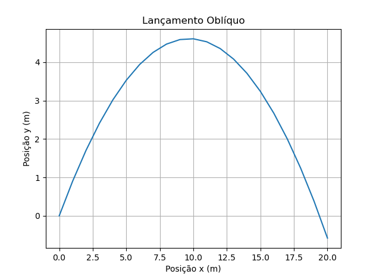

# Atividade 2 - Classe Partícula

Esta atividade tem como objetivo explorar os fundamentos de programação orientada a objetos em Python, por meio da criação de uma classe chamada `Particula`. Essa classe representa uma partícula em um espaço bidimensional, com atributos de posição, velocidade e massa, e um método que aplica a segunda lei de Newton para atualizar a trajetória da partícula a partir de forças aplicadas. No exemplo implementado, simulamos o lançamento oblíquo de uma partícula sob a ação da gravidade, e ao final, geramos um gráfico mostrando a trajetória da partícula no plano (x, y).

**Resultado**: 

